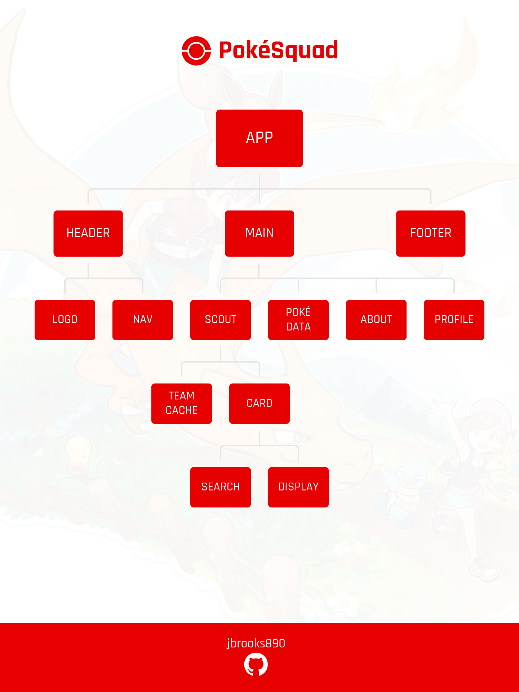

# PokéSquad App

<b>PokéSquad</b> is an unofficial Pokémon companion app that assists players with building and planning their Pokémon teams. Choose from the complete catalog of 900+ Pokémon. Create multiple teams for various situations. Customize your Pokémon by giving them a unique name and by modifying their movesets.

## MVP

An app that allows for the user to build and store multiple teams of Pokemon.

## Post MVP

### Team Customization

Increased customization functionality, allowing the user to customize his/her/their team (team name, team description, etc.) Additionally

### Pokemon Customization

Allow the user to give each Pokemon a unique name and moves.

### Master Pokemon Cache

A collection of all the user's customized Pokemon to be arranged on various teams.

# SWOT

## Strengths

Styling

## Weaknesses

Displaying a multitude of Pokemon data

## Opportunities

## Threats

# Hierarchy

